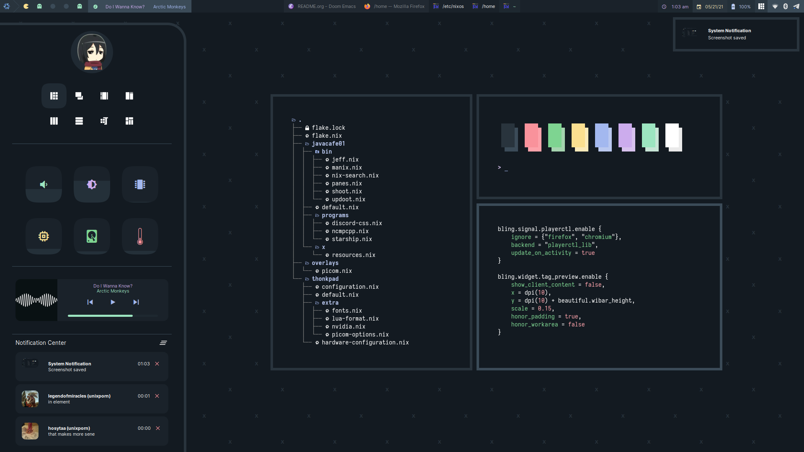
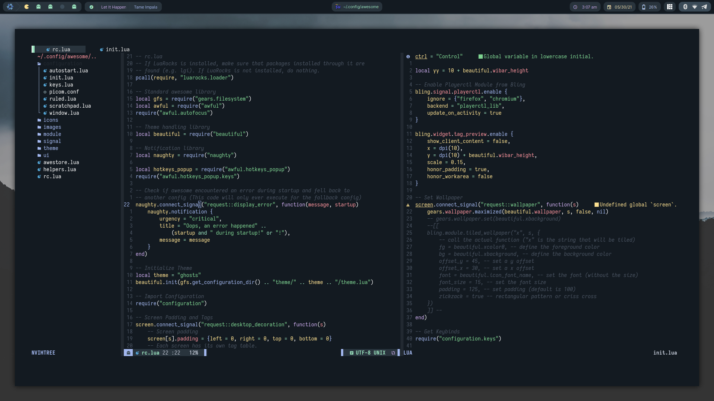
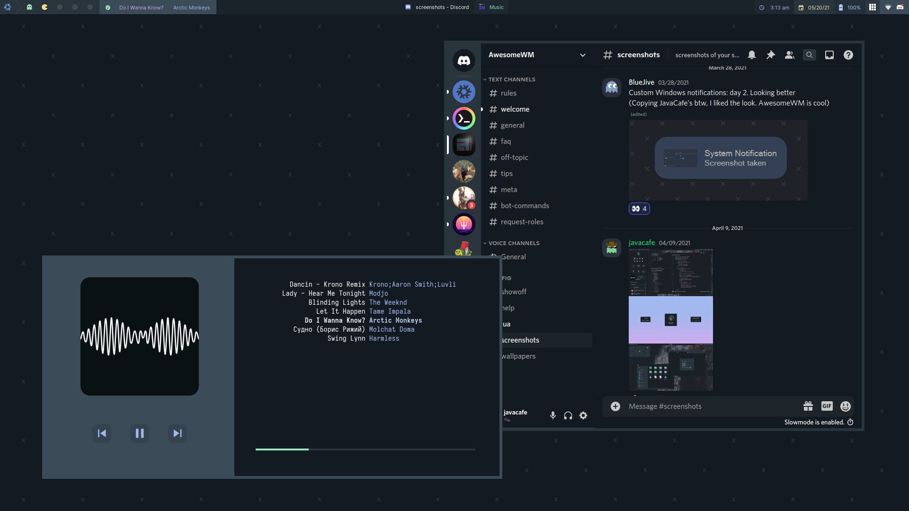
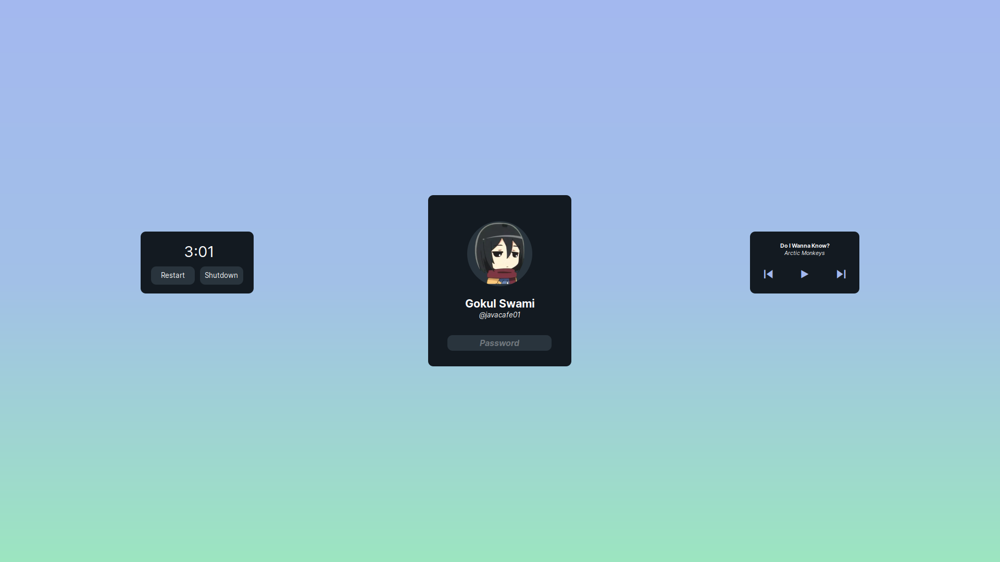

NOTE: These dotfiles are outdated. I will be adjusting them (making a separate repo for my NixOS configuration and my setup for AwesomeWM) soon.

# dotfiles

 

Welcome to my system configuration files! My system is managed by Nix, as I use NixOS. Well, most of it is. My AwesomeWM configuration and Neovim configuration files are still written in lua, as the number of edits, features, and customizations I have done on them are too massive for me to convert those configs to Nix. The only configuration left to convert to Nix is **wezterm**.

**Note**: Please don't use this as a template NixOS setup - I just started using NixOS and I'm sure what I'm doing isn't the best at some places.

## Install
(in progress)

## Modules
### [bling](https://github.com/BlingCorp/bling)
- Adds new layouts, modules, and widgets that try to primarily focus on window management
### [layout-machi](https://github.com/xinhaoyuan/layout-machi)
- Manual layout for Awesome with an interactive editor
### [UPower Battery Widget](https://github.com/Aire-One/awesome-battery_widget)
- A widget accessing **UPower** for battery info with LGI
### [rubato](https://github.com/andOrlando/rubato)
- Creates smooth animations with a slope curve for awesomeWM (Awestore, but not really)
### Better Resize
- An improved method of resizing clients in the tiled layout
### Save Floats
- Saves positions of clients in the floating layout

## Screenshots
### Main

- Panel widget (with notification center)
- Notifications (made with the AwesomeWM API)
### Neovim

- Neovim 0.5+ (nightly)
- [Configuration](https://github.com/JavaCafe01/NvChad)
### Browser

- CSS is under [`/etc/nixos/javacafe01/programs/firefox`](https://github.com/JavaCafe01/awedots/tree/master/etc/nixos/javacafe01/programs/firefox)
### Scratchpads

- Ncmpcpp with mopidy-spotify
- Discord with [discocss](https://github.com/mlvzk/discocss)
### Lockscreen

- Built with the AwesomeWM API

## Special Thanks
- [elenapan's dotfiles](https://github.com/elenapan/dotfiles)
- [fortuneteller2k's NixOS Configuration](https://github.com/fortuneteller2k/nix-config)
